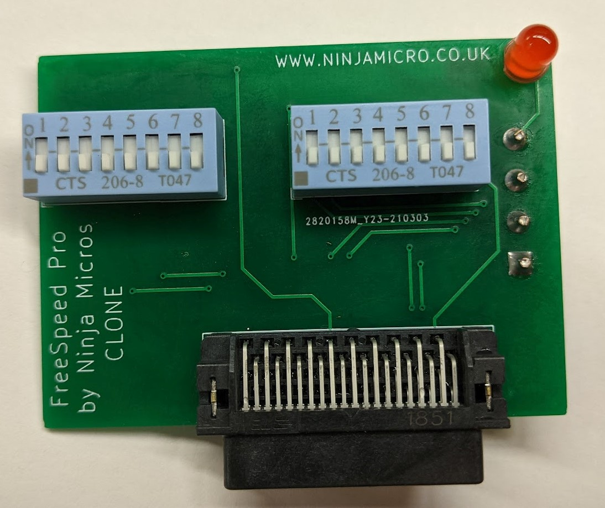

# AMD K7 FreeSpeed Pro Clone
This device attaches to the AMD K7 debug port and provides for overclocking. It is a clone of the FreeSpeed Pro by Ninja Micros.

## Vogons.org Project
URL: https://www.vogons.org/viewtopic.php?t=71328

## Project Status
Tested and working by numerous people. Results may vary based on CPU and motherboard support.

## Building / Installing
This repository contains the KiCAD files, Gerbers, BOM and Pick & Place files. The BOM and Pick & Place files are formatted for JLCPCB assembly. They can be directly uploaded along with the Gerbers for their SMT assembly service. Parts subsitutions may be required if certain components are out of stock due to component/chip shortages. Through-hole components are to be soldered after you receive the board from JLCPCB.
* If performing assembly the assembly entirely by hand, solder all SMD components on the back first, along with the 4-pin molex connector.
* Next, solder the dip switches, socket connector, and LED. That's it!
* Refer to the Ninjamicro Jumper Settings picture in the repository to set your DIP switches properly. Don't start out with too aggressive of an overclock.
* On your AMD K7 CPU, open the casing to expose the debug connector.
* Plug the FreeSpeed device into the connector and attach a 4-pin molex cable.
* Test boot the machine and have fun.

## Optional
You can cut the AMD K7's housing with a pair of side cutters and file to make the FreeSpeed Pro fit while the shroud is installed. Measure twice, cut once. 

## Miscellaneous
This is an open hardware design, so do what you want with it. I tried contacting the original creator through all points of contact I could find, and there was no answer back. There are no copyright, trademark, or registration marks on the original device and the website no longer exists. This device also very closely matches the schematics in the Tom's Hardware article from November 13th, 1999 titled "Make Your Own Athlon Overclocking Device".
